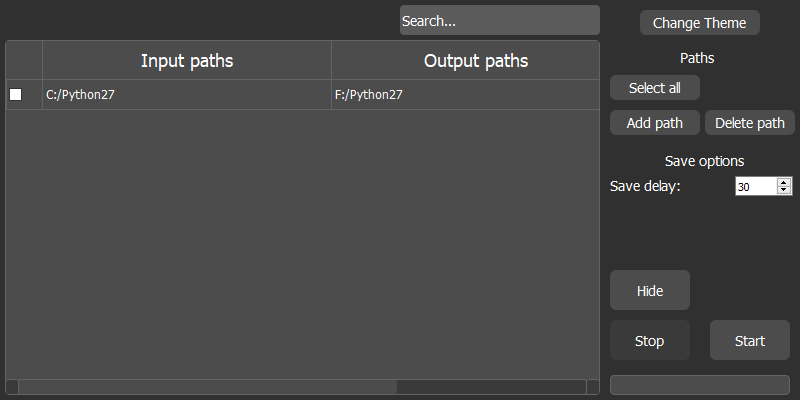

<h1 align="center">
    docSaverPy
</h1>

> A software that automates the file saving process
<div align="center">
    
</div>
docSaverPy is an open source software made using PyQt. It lets you save your files and allows you to automate this process.

## Requirements
- [Python 3](https://www.python.org)

## Install
```
git clone https://github.com/TrAyZeN/docSaverPy.git
cd docSaverPy
pip install -r requirements.txt
```

## License
MIT TrAyZeN
